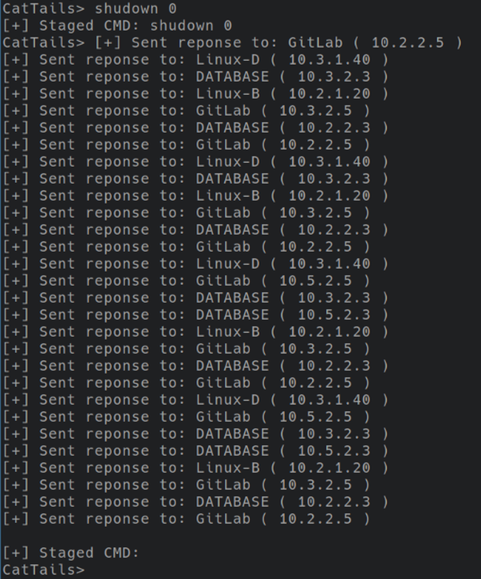

# CatTails (Alpha)

## Overview  
This project is a redteam implant that leverages raw sockets to 
send/recieve callbacks from a C2 infrastructure. It also offers a library, _cattails.go_, for users to create their own raw socket applications in Golang. This project **does not** use host dependecies like _libpcap_.
  
The callbacks and communication happen over a UDP port. You will be able to send/execute commands on the remote host via a C2 server.  

### Current Features
-----------

-  **Root commands**
    - CatTails allows you to send bash commands which will be sent to bots where they will be executed with root privleges. 
- **Bypass Host Firewalls**
  - CatTails uses raw sockets for the communication between the server and bots. This means that host firewalls will not be able to stop the traffic, allowing you to run commands even when the host is set to _drop all_.
- **Command feedback/output**
    - There is currently **no** feedback from bots in the alpha verison  
- **Customized HELLO**
    - I am leaving the implementation of the HELLO messages up the person writing the bot/c2 to allow flexibility.
      However, there is a function for creating HELLO messages if you choose to use it. The parsing will be left up
      to the implementation.

### v.Alpha Overview
-----------

- [x] RAW sockets that allow bypass of host-based firewalls 
- [x] Bots dynamically determine gateway MAC, IP, etc. during install
- [x] IP/UDP Header lengths and checksums are properly computed
- [x] Packets are properly filtered 
- [x] Does not use _libpcap_ or similar host dependencies
- [x] Payloads are parsed and handled based on C2 or bot needs
- [x] Bots will send HELLO messages on a time interval, providing the C2 with client info
- [x] C2 simple CLI to interface with bots

## Issues at a Glance
-----------

- Segfault if bot/server receives UDP packets that are not packets for/from CatTails. This issue lies in the parsing of received packets
- Possible bottle necking and performance issues when the number of bots reaches around 90+ (more testing needed)
- You are currently only able to stage/send commands to **_ALL_** hosts or a single, targeted host.
- Bug when staging a _TARGET_ command where the server says _sending response to <BOT-IP>_ for any bot that calls back. This means that the server does not inform the operator that the _TARGET_ command was actually sent to the target.
 
# Usage

CatTails' main purpose is to offer a Golang library that allows people to create and use raw sockets without host dependencies like _libpcap_. However, I have completed a bot/c2 implementation that, albeit basic, works very well for red team competitions. I included some of the bot/c2 functions in the library as example code, but much of the application level functionality should be handled by the user. I just wanted to create a library so that people would not have to deal with raw sockets. 

## Configuration
-----------
Below you will find instructions on how to configure the bot/c2 for a competition.

To configure the bot and server you will need to edit a few lines in both the `server.go`, `bot.go`, and optionally the `cattails.go` files. 

- `bot.go`
  - Change the _IP Address_ in _main()_ where `cattails.GetOutwardIface()` is called. This will be used to auto configure the interface for CatTails to use on the infected machines. This IP is most commonly `8.8.8.8:80` (for general internet access) or you can set this IP as the IP of your server.
  - Change the _IP Address_ in _main()_ where `go sendHello()` is called. This defines the IP address for the CatTails server. This can be the same IP as the bullet above.
  - **Optional** -- Change the `SRC` and `DST` port values in _sendHello()_ where `cattails.CreatePacket()` is called. You will need to change these values based on the filter you set.

- `server.go`
  - Change the _IP Address_ in _main()_ where `cattails.GetOutwardIface()` is called. This will be used to auto configure the interface for CatTails to use on the server. This IP is most commonly set to an infected machine's IP, or some IP that, if you can hit it, means you can also hit the network of the infected hosts. 

**NOTE**
> An IP setting is only used for automatic configuration of the CatTails bot/server. Once they are running these IPs no longer matter (except for where the bot is sending data back to the C2). This means if you set the IP address for the server configuration option to an infected machine's IP and you lose the ability to hit that infected machine, you will not lose all of the bots.

- `cattails.go`
  - You can change the _BPF filter_ in the `cattails.go` file. It is defined as `var FilterRaw`. You can generate these filters by using `tcpdump _your-filter-here_ -dd`. This will output a _BPF_ struct that implements the filter you made in the _tcpdump_ command. Just copy and paste the struct that _tcpdump_ gave you into `cattails.go` to replace the current filter.

**NOTE**
> If you replace the filter, remember to configure the bot with the correct filter information otherwise it will not receive any information from the server (Look at the _optional_ configuration for `bot.go`). 

## Installation
-----------

Installing CatTails is up to the user. Once the bot and server have been _configured correctly_ all you have to do is run the respective binaries on the systems you wish to use. That's it! You do _NOT_ need to run the server before running the bots or vice versa. 

## SEND THOSE COMMANDS!
-----------

Now that you have your server and bots running, you can stage commands through the server CLI. To stage a command, type in the desired _bash_ command to run and hit enter. You should see a message informing you of the staged command. Now whenever a bot calls back, you should see a message that the server sent a response to a bot. When this message appears, it means that the server has sent the command to the bot for execution. To _unstage_ a command hit the enter key once to effectively enter an _empty string_ as the _STAGED_ command (really high tech I know).

To stage a _TARGET_ command, type `TARGET` into the `CatTails>` prompt. Then enter the _IP_ of the machine you want to target. Then enter the _command_ you want the target machine to execute. Then wait for that machine to callback! **See _bugs_ section**
To clear a _TARGET_ command you need to type `TARGET` again into the CLI and spam the enter key to "_zero_" out the _TARGET COMMAND_ and _TARGET IP_ values (super high tech).